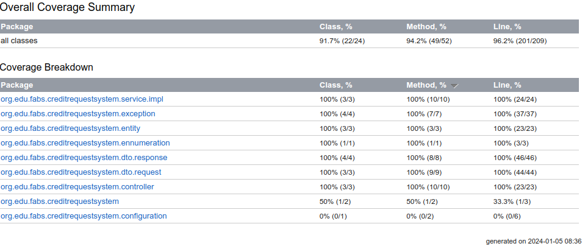

# Credit Application System - Kotlin API Rest
#### Prof. Camila Cavalcante

<hr>

<p align="center">API Rest para um Sistema de Analise de Solicitação de Crédito</p>
<p align="center">
     <a alt="Java">
        
    </a>
    <a alt="Kotlin">
        
    </a>
    <a alt="Spring Boot">
        
    </a>
    <a alt="Gradle">
        
    </a>
    <a alt="H2 ">
        
    </a>
    <a alt="Flyway">
        
    </a>
</p>

<p>Uma empresa de empréstimo precisa criar um sistema de análise de solicitação de crédito. Sua tarefa será criar uma <strong>API REST SPRING BOOT E KOTLIN</strong> 🍃💜 para a empresa fornecer aos seus clientes as seguintes funcionalidades:</p>

<h3>Instrução de Uso</h3>
<p>No Terminal/Console:</p>
<ol>
	<li>Faça um clone do projeto na sua máquina: <code>git clone git@github.com:bianavic/credit-application-system.git</code></li>
	<li>Entre na pasta raiz do projeto: <code>cd </code></li> 
	<li>Execute o comando: <code>./gradlew bootrun</code></li>
</ol>

[POSTMAN - JSON Collection](collection/dio-koltin.postman_collection.json)

<ul>
<li><h3>Cliente (Customer):</h3>
  <ul>
    <li><strong>Cadastrar:</strong>
         <ol>
            <li><strong>Request: </strong><em>firstName, lastName, cpf, income, email, password, zipCode e street</em></li>
            <li><strong>Response: </strong><em>String</em></li>
        </ol>
    </li>
  <li><strong>Editar cadastro:</strong>
    <ol>
      <li><strong>Request: </strong><em>id, firstName, lastName, income, zipCode, street</em></li>
      <li><strong>Response: </strong><em>firstName, lastName, income, cpf, email, income, zipCode, street</em></li>
    </ol>
  </li>  
  <li><strong>Visualizar perfil:</strong>
    <ol>
      <li><strong>Request: </strong> <em>id</em></li>
      <li><strong>Response: </strong><em>firstName, lastName, income, cpf, email, income, zipCode, street</em></li>
    </ol> 
  </li>
  <li><strong>Deletar cadastro:</strong>
    <ol>
      <li><strong>Request: </strong><em>id</em></li>
      <li><strong>Response: </strong><em>sem retorno</em></li>
    </ol>
  </li>
  </ul>
  </li>
  <li><h3>Solicitação de Empréstimo (Credit):</h3>
  <ul>
    <li><strong>Cadastrar:</strong>
         <ol>
            <li><strong>Request: </strong><em>creditValue, dayFirstOfInstallment, numberOfInstallments e customerId</em></li>
            <li><strong>Response: </strong><em>String</em></li>
        </ol>
    </li>
    <li><strong>Listar todas as solicitações de emprestimo de um cliente:</strong>
    <ol>
      <li><strong>Request: </strong><em>customerId</em></li>
      <li><strong>Response: </strong><em>creditCode, creditValue, numberOfInstallment</em></li>
    </ol> 
    </li>
    <li><strong>Visualizar um emprestimo:</strong>
    <ol>
      <li><strong>Request: </strong><em>customerId e creditCode</em></li>
      <li><strong>Response: </strong><em>creditCode, creditValue, numberOfInstallment, status, emailCustomer e incomeCustomer</em></li>
    </ol> 
    </li>
</ul>

<figure>
<p align="center">
  <br>
  Diagrama UML Simplificado de uma API para Sistema de Avaliação de Crédito
</p>
</figure>
<figure>
<p align="center">
  <br>
  Arquitetura em 3 camadas Projeto Spring Boot
</p>
</figure>

<h3>Regras de Negócio para a solicitação de empréstimo:</h3>
<ol>
  <li>o máximo de parcelas permitido será 48</li>
  <li>data da primeira parcela deverá ser no máximo 3 meses após o dia atual</li>
</ol>
<hr>

### Code Coverage Report


<hr>
<h3>Links Úteis</h3>
<ul>
  <li>https://start.spring.io/#!type=gradle-project&language=kotlin&platformVersion=3.2.2-SNAPSHOT&packaging=jar&jvmVersion=17&groupId=org.edu&artifactId=credit-application-system&name=credit-application-system&description=Credit%20Application%20System%20with%20Spring%20Boot%20and%20Kotlin&packageName=org.edu.credit-application-system&dependencies=web,validation,data-jpa,flyway,h2</li>
  <li>https://docs.spring.io/spring-boot/docs/2.0.x/reference/html/common-application-properties.html</li>
  <li>https://medium.com/cwi-software/versionar-sua-base-de-dados-com-spring-boot-e-flyway-be4081ddc7e5</li>
  <li>https://strn.com.br/artigos/2018/12/11/todas-as-anota%C3%A7%C3%B5es-do-jpa-anota%C3%A7%C3%B5es-de-mapeamento/</li>
  <li>https://pt.wikipedia.org/wiki/Objeto_de_Transfer%C3%AAncia_de_Dados</li>
  <li>https://pt.wikipedia.org/wiki/CRUD</li>
  <li>https://docs.spring.io/spring-data/jpa/docs/current/reference/html/#repository-query-keywords</li>
  <li>https://docs.spring.io/spring-data/jpa/docs/current/reference/html/#jpa.query-methods.at-query</li>
  <li>https://docs.spring.io/spring-data/jpa/docs/current/reference/html/#glossary</li>  
</ul>
<hr>
<h3>Troubleshooting</h3>

[Credit Repository Test - solved] 

EntityExistsException and PersistentObjectException: detached entity passed to persist
- change *persist* to *merge* to merge the detached objects in the session
```kotlin
FROM:
customer = testEntityManager.persist(CustomerStub.buildCustomer())
TO:
customer = testEntityManager.merge(CustomerStub.buildCustomer())
```
  link: https://stackoverflow.com/questions/23645091/spring-data-jpa-and-hibernate-detached-entity-passed-to-persist-on-manytomany-re
<br></br>
[Controller Tests - gambiarra] post, find and update methods
AssertionError: JSON path "$.id" expected: X but was: Y

The tests are failing when run together because the ID values are changing between runs.
This is due to the nature of the @GeneratedValue strategy used in Hibernate,
where the ID is auto-generated and may not always start from 1.
obs: @TestMethodOrder, @TestInstance and @BeforeEach @AfterEach annotations did not work, the same error still remains

- change *.value(1L)* to *.exists()*
```kotlin
FROM:
.andExpect(MockMvcResultMatchers.jsonPath("$.id").value(1L))
TO:
.andExpect(MockMvcResultMatchers.jsonPath("$.id").exists())
```